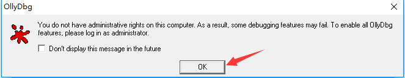

## 一、OD使用

## 1、双击打开

- 我点击了OK

- 然后继续点击OK

## 2、使用-分析的几种方式

### （1）（未运行的exe）将test.exe拖到这个OD中解析上

- 解析后效果如下

- 修改字体、颜色、高亮

### （2）（未运行的exe）用文件-》打开

### （3）（已经运行的exe）

- 用文件-》附加（attach），选择要分析的进程

## 二、OD使用插件查找字符串

## 1、HelloWord程序分析

- 会跳转到这个

- 就可以查找了

## 一、动态调式工具
a、Microsoft Visual C++ 6.0
 - 调试相对简单，因为有源代码对照。

b、Ollydbg(简称OD)基本使用（读作，olly debug）
 - 这个对没有用过的朋友，可能有一点陌生

c、实战
修改程序输出ReverseMe。
第一种：不修改程序流程，直接把Hello world!修改为：ReverseMe。
第二种：修改程序的流程让它输出ReverseMe。

### （1）OD常用快捷键

|快捷键  |作用	 |
|---	|---	|
|F2		|在OD的反汇编视图中使用F2进行下断，下好一个断点|
|F3		|文件-》打开|
|F4		|程序执行到当前光标位置|
|F5		|缩小、还原当前窗口|
|F7		|**单步步入**，进入函数内,跟进到CALL地址处|
|F8		|**单步步过**，越过函数实现，不会进入CALL地址处|
|F9		|直接运行程序，遇到断点程序暂停|
|Ctrl+f9|执行到函数返回，用于跳出函数|
|Alt+f9	|执行到用户代码处，用于快速跳出系统函数|
|Ctrl+G	|输入十六进制地址，在反汇编或数据窗口中快速定位到该地址处，效果有点像Ctrl+F|

### (2)用OD改变程序流程啥的

定位helloword

- 使用插件——**查找字符串插件**

