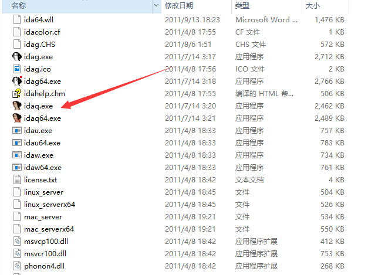
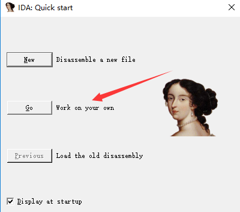
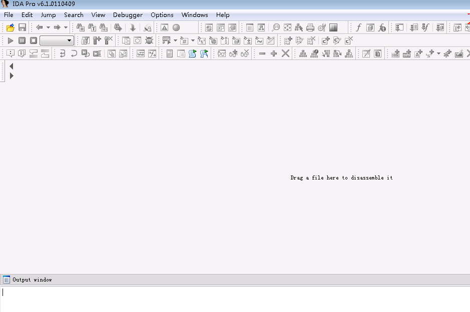
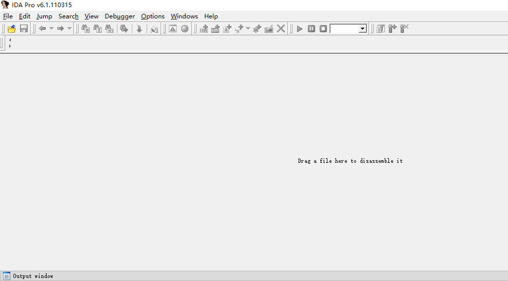
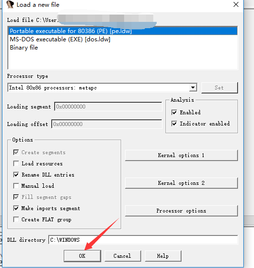
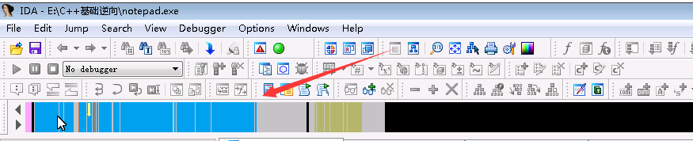

## 1、上课用的IDA

## 2、我用的IDA

- 这个表示被加载文件的空间的线性视图。

### 快捷键X

可以看当前函数被引用的地方。交叉引用，关于交叉引用的强大之处后面会将

###  IDA的流程图功能

## 二、静态分析工具IDA的介绍及基本使用

a、IDA基本使用
1、IDA桌面简介
2、基本配置
2、恢复IDA界面
3、Strings窗口与交差引用相结合快速定位代码
b、实战

- IDA是一个专业逆向分析调试工具，不是免费的。我们可以随时到网上下载一个IDA破解版
- IDA功能十分强大，要是讲太详细，难以讲完
- 教程中IDA版本是6.1版本
- DA PRO简称IDA（Interactive Disassembler） ，是一个世界顶级的交互式反汇编工具。
在破解领域它是威名震天的强大工具，主要用在反汇编和动态调试等方面，另外它的分析技术是最为称赞的一点。

